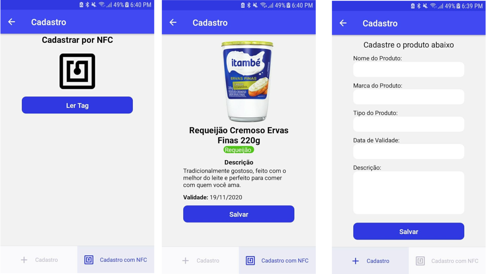
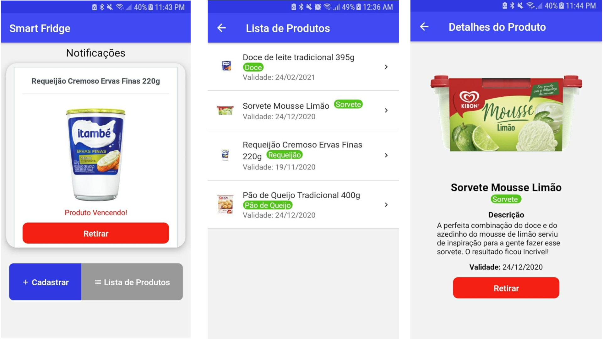

# Aplicativo de Gestão de Alimentos

## Nome da Aplicação: 

- Smart Fridge

## Feito por:

- [Luiz Gustavo Bragança dos Santos](https://github.com/Luizgustavo358)

## O que a aplicação faz:

A aplicação faz o gerenciamento de alimentos em uma geladeira, onde você consegue ver quais estão dentro dela e os prestes a vencer.

## Descrição das Telas

- Home

Nesta tela da aplicação, vemos as notificações de alimento prestes a vencer (menos que 7 dias) na área de notificações, e abaixo os botões para cadastro e listagem.

- Cadastrar Produtos

Tela para fazer o cadastro dos alimentos, contando com o nome e sua validade.

- Listar Produtos

Mostra todos os alimentos cadastrado no sistema.

- Mostrar Produto

Mostra o nome e a validade do produto cadastrado.

## Dados usados

Como visto anteriormente, a aplicação usa apenas o nome e a validade de cada produto para ser cadastrado no mesmo.

## Imagens do aplicativo

---

## O que eu usei:

- Wireframe:
  - [Moqups](https://moqups.com/)

- Protótipo:
  - [Figma](https://www.figma.com/)

- PWA (Progressive Web Application):
  - [HTML](https://developer.mozilla.org/pt-BR/docs/Web/HTML)
  - [JavaScript](https://developer.mozilla.org/pt-BR/docs/Web/JavaScript)
  - [CSS](https://developer.mozilla.org/pt-BR/docs/Web/CSS)

- Banco de Dados:
  - [MongoDB](https://www.mongodb.com/)

- Back-end:
  - [Node.js](https://nodejs.org/en/)
  - [Heroku](https://www.heroku.com/)

- Testar Requisições:
  - [Insomnia](https://insomnia.rest/)

- Aplicativo:
  - [React Native](https://reactnative.dev/)

- RFID (Radio-Frequency IDentification)